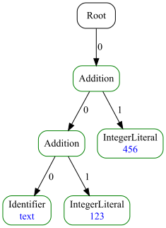

# Astranaut Core — The Heart of the Tree


[](https://codecov.io/gh/cqfn/astranaut-core)
[](https://github.com/unified-ast//astranaut-core/blob/master/LICENSE.txt)
___

# Brief

Welcome to **Astranaut Core** — or just **Core**.

This module contains all the **fundamental interfaces and base classes** that define the structure of syntax trees,
along with a growing collection of **reusable algorithms** for working with them.

It’s packaged as a standalone **Maven dependency**, and it serves two main roles:

- ✅ It powers the **[Astranaut](https://github.com/cqfn/astranaut)**  tool itself — including code generation,
  interpretation, and transformation.
- ✅ It’s what you’ll **include in your own project** when Astranaut generates Java source files for your custom trees.

So if you're working with anything Astranaut produces, you're working with Core — whether you know it or not.

# Requirements

* Java 1.8
* Maven 3.6.3+ (to build)

# How to Add Astranaut Core to Your Project

Astranaut Core is published as a regular Maven dependency.

Just add this to your `pom.xml`:

~~~xml
<dependencies>
  <dependency>
    <groupId>org.cqfn</groupId>
    <artifactId>astranaut-core</artifactId>
    <version><!-- latest version here --></version>
  </dependency>
</dependencies>
~~~

You can find the latest release number [here](https://github.com/cqfn/astranaut-core/tags). 

# The Basics: Interfaces & Classes  
This is where the tree magic starts.  

These interfaces and helpers define **what every syntax tree node looks like**—including the ones Astranaut generates
for you. They’re:

- **Minimal** (No fluff.)  
- **Immutable** (No surprises.)  
- **Codegen-friendly** (Easy to auto-implement.)  

## **Node – The Atomic Unit of Syntax Trees**  

### **Core Philosophy**  
`Node` is the **fundamental building block** of all syntax trees in Astranaut. Designed with three key principles:  
1. **Minimalism** - Only essential methods, zero fat  
2. **Immutability** - Thread-safe by design  
3. **Generation-friendly** - Optimized for automatic codegen  

### **Key Features**  

| Method | Returns | Purpose |  
|--------|---------|---------|  
| `getType()` | `Type` | The node's classification (e.g., "IfStatement") |  
| `getData()` | `String` | Node-specific content (e.g., variable name) |  
| `getChildCount()` | `int` | Number of child nodes |  
| `getChild(index)` | `Node` | Access to child nodes |  

**Bonus Capabilities (Defaults Included):**  
- **Source Mapping**: `getFragment()` ties nodes to original code  
- **Property System**: `getProperties()` for metadata (colors, tags)  
- **Deep Operations**: `deepCompare()`, `deepClone()` for whole-subtree work  

### **Why This Design Rocks**  

**For Humans:**  
```java
// Clear what every node contains
if (node.getType().getName().equals("Variable")) {
    String varName = node.getData(); // Simple and obvious
}
```

**For Machines:**  
```java
// Easy code generation
public class GeneratedNode implements Node {
    // Only 4 core methods to implement
    public Type getType() { return Type.VARIABLE; }
    // ... rest auto-generated by Astranaut
}
```

**For Algorithms:**  
```java
// Efficient tree walking
void process(Node node) {
    node.forEachChild(child -> {
        // Uniform interface works for all node types
    });
}
```

### **Advanced Goodies**  

1. **Structural Hashing**  
   - `getLocalHash()` - Fingerprint of type + data  
   - Enables fast subtree comparison  

2. **Type Hierarchy**  
   - `belongsToGroup()` - Check node categories (e.g., "Expression")  

3. **Memory-Safe Iteration**  
   - `ChildrenList`/`ChildrenIterator` - Zero-copy child access  

### **When You'll Love This Interface**  
- **Building parsers** - Just implement 4 core methods  
- **Writing transformations** - Uniform interface for all nodes  
- **Debugging** - `toString()` shows complete structure  

*"The interface that launched a thousand trees."* 🌳🚀

## **Type – Because Not All Nodes Are Created Equal**  

Alright, so your `Node` has a `Type` – that's this handy little interface that tells you *what kind* of node
you're dealing with.  

**Key things about `Type`:**  
- **One type, many nodes** – Like a cookie cutter stamping out cookies.  
- **Singleton by default** – If you're using Astranaut DSL, it'll generate these for you as singletons (no duplicates, no fuss).  
- **Comes fully loaded** with:  
  - A **name** (so you know what to call it)  
  - **Child descriptors** (to validate node structure when building)  
  - **Parent hierarchy** (to check whether nodes belong to a specific group)
  - A **Builder factory** (for crafting new nodes of this type)  
  - Optional **custom properties** (key-value metadata, because sometimes you need extra sauce)  

**But here's the cool part:** If you're *manually* implementing `Type`, you only **need** two things:  
1. The type's **name**  
2. A way to **create Builders** for it  

Everything else? Optional. We keep it flexible.  

## **Builder – Your Safe Node Creation Buddy**  

Let’s talk **`Builder`**—the only *proper* way to create nodes when you’re dealing with Astranaut-generated trees.  

#### **Why Not Just Use a Constructor?**  
- **No public constructors**: If your node comes from Astranaut DSL, it’s **immutable** and has **no public `new`**.  
- **Mutation? Nope**: Hand-written nodes *might* be mutable, but Astranaut’s aren’t. **Builder enforces correctness.**  
- **Algorithms expect it**: Every tree-modifying tool in this library uses `Builder`.  

### **How It Works**  
1. **Create a `Builder`** (usually via `Type`).  
2. **Feed it stuff** (in any order):  
   - A **`Fragment`** (optional, if your node tracks source code).  
   - **Data** if exists (as a `String`—returns `false` if invalid).  
   - **Child nodes** if any (also returns `false` if the list is illegal).  
3. **Check `isValid()`** (because mistakes happen).  
4. **Call `createNode()`** → *Boom!* New node.  
   - (Or `IllegalStateException` if you skipped `isValid()` and the builder’s unhappy.)  

**Bonus:** Calling `createNode()` again gives you a **fresh copy**—same specs, new object.  

### **The Golden Rule**  
> *"If a node exists, it’s correct."*  
Builders **guarantee** valid nodes. No half-baked, malformed nonsense.  

### **DSL vs. Hand-Rolled Nodes**  
- **Using Astranaut DSL?** Builders are **auto-generated**. Easy.  
- **Writing custom nodes?** You have to implement a `Builder` — or most algorithms **won’t work**.  
- **Pro tip:** Just **use the DSL**. Let Astranaut handle this.  

## **Tree – Fancy Node Wrapper (But Useful)**  

Let’s be real: **any `Node` is already a tree** (or at least a subtree) because it can have children.
But we went ahead and made `Tree` anyway. Why? Because sometimes you wanna point at a root and say:  

*"Behold! This right here? This is a **Syntax Tree**."*  

### **What’s Inside?**  
- **A root `Node`** (obviously).  
- **Extra utility methods** (for tree-wide operations).  

That’s it. No magic, no overengineering—just a clean way to mark *"this node is the whole deal."*  

### **Philosophy**  
- **`Node`**: A piece of the tree.  
- **`Tree`**: The *official* container for the root + helpers.  

## **Node Null-Objects: DummyNode vs NullNode**

Meet Our Polite Non-Null Alternatives:

### **DummyNode** - The Forgiving Placeholder
> *"I'll pretend to be a real node so your code doesn't break"*

- **Why It Exists**:
  - Avoids `null` checks while maintaining node interfaces
  - Acts as temporary placeholder in incomplete structures
  - Supports cloning/building pattern (returns same instance)

- **Behavior**:
  ```java
  node.getData() // → "" (empty string)
  node.getChild(0) // → throws IndexOutOfBoundsException
  node.getType().createBuilder() // → returns builder (but always reconstructs THE SAME instance)
  ```

### **NullNode** - The Intentional Void
> *"I represent the conscious absence of value"*

- **Why It Exists**:
  - Marks explicitly invalid states (vs missing data)
  - Fails fast on mutation attempts

- **Behavior**:
  ```java
  node.getData() // → "" (empty string) 
  node.getChild(0) // → throws IndexOutOfBoundsException
  node.getType().createBuilder() // → throws UnsupportedOperationException
  ```

### **Key Difference vs. `null`**  

|                           | `DummyNode`            | `null`                     |  
|---------------------------|------------------------|----------------------------|  
| **Safe to call methods?** | ✅ (no-op)              | 💥 `NullPointerException`  |  
| **Children?**             | ❌ (but reports `0`)    | 💥 Crash                   |  
| **Type?**                 | ❌ (but won’t complain) | 💥 Crash                   |  

## **EmptyTree – The Polite Way to Say "Nothing Here"**  

**What it is:**  
- A **singleton tree** that contains a `DummyNode` as its root.  
- The **official "empty" representation** when you need a valid `Tree` instead of `null`.  

## **Fragment, Position & Source – The Location Trio**  

### **Fragment**  
Every node can **optionally** have a `Fragment` – a bookmark pointing to the **exact chunk of source code**
it represents.  

**Out-of-the-box implementations:**  
- `EmptyFragment` → For nodes that **don’t track source** (default).  
- `DefaultFragment` → If you **have source mappings** (uses `Position` start/end).  

**Roll your own?**  
Implement `Fragment` if you need **custom source tracking** (e.g., for non-textual formats).  

### **Position**  
A `Position` pinpoints a **specific spot** (line + column) in the source. Comes with:  
- `DefaultPosition` → Ready-to-use implementation.  
- **Works with `Source`** → To resolve actual code snippets.  

### **Source**  
The "know-it-all" backend for `Position`. Tracks:  
- **What’s being parsed** (e.g., a file, a string).  
- **How to extract code** between two `Position`s.  

**Implementations included:**  
- `StringSource` → For raw strings.  
- `FileSource` → For file-based code.  

### **How They Work Together**  
1. **Node** → Has a `Fragment` (or `EmptyFragment`).  
2. **Fragment** → Stores start/end `Position`s.  
3. **Position** + **Source** → Can reconstruct the **original code snippet**.  

## **Factory – Your Node Creation Command Center**  

**What it does:**  
- **Gives you `Type` and `Builder` objects** just by asking for a type name.  
- **Centralized node production** – no manual instantiation headaches.  

**Key Features:**  
- **`getType(String name)`** → Fetch a `Type` by its registered name.  
- **`createBuilder(String name)`** → Spawn a ready-to-use `Builder` for that type.  
- **DSL-generated** → If you're using Astranaut, factories come pre-built with all your node types.  

**Why It Matters for Transformations:**  
Algorithms that **rewrite trees** rely on factories to:  
1. **Create new nodes** on the fly (without knowing their internals).  
2. **Ensure type safety** (only valid nodes get built).  

## **Transformer – The "Tree In, Tree Out" Black Box**  

**What it is:**  
- The simplest interface ever: **`Tree transform(Tree input)`**  
  - Takes a tree, *maybe* changes it, returns a tree (new or same instance).  
- **No promises** about *how* it transforms—just that it **does**.  

### **How Astranaut DSL Handles It**  
1. **You write rules** in the DSL (e.g., *"replace all `Foo` nodes with `Bar`"*).  
2. **Astranaut generates:**  
   - **`Converter` classes** (one per rule) – do the actual grunt work.  
   - **A master `Transformer`** – glues all `Converter`s together into one `transform()` call.  

**Result:**  
- Your **`Transformer` is just a facade** hiding a pipeline of smaller conversions.  
- **Zero boilerplate** – the generated code handles the complexity.  

### **Key Points**  
- **Immutable-friendly**: Always returns a tree; never mutates the input.  
- **Idempotent? Optional**: Depends on your rules (not enforced by the interface).  
- **DSL advantage**: Lets you **think in rules**, not manual tree-walking.  

## **Provider – Your One-Stop Shop for Factories & Transformers**  

**What it is:**  
The **final generated piece** that ties everything together — a central registry for:  
- **Factories** (to create nodes)  
- **Transformers** (to modify trees)  

### **How It Works**  
1. **You define languages and rules** in your DSL.  
2. **Astranaut generates** a `Provider` that:  
   - **Exposes factories/transformers per language** (e.g., `getFactory("python")`).  
   - Defaults to `"common"` if no language is specified.  

### **Why It’s Handy**  
- **Single access point** – No hunting for factories/transformers.  
- **Language-aware** – Swap implementations by name (e.g., `"java"` vs `"kotlin"`).  
- **Required by some tools** – Like the built-in **JSON deserializer**.  

### **Key Details**  
- **Minimal interface**: Just `getFactory()` and `getTransformer()`.  
- **No magic**: All heavy lifting is done during codegen.  
- **Extensible**: Add custom providers for non-DSL use cases.  

# **Algorithms & Extensions – Your Tree-Toolbox**  

**What’s here:**  
Various utilities to **analyze, modify, and traverse** syntax trees.  
Think of them as **power-ups** for working with Astranaut’s core.  

## **ExtNode & ExtNodeCreator – Turbocharged Tree Navigation**  

### **What Problem They Solve** 

Sometimes, vanilla `Node` is *too minimal*—you need:

- **Parent/left/right sibling access** (for complex traversals).  
- **Structural hashing** (to compare entire subtrees in O(1)).  

Enter **`ExtNode`** (extended node) and **`ExtNodeCreator`** (its builder).  

### **ExtNode: Supercharged Node**  
Adds these **key methods** to `Node`:  
- **`getParent()`** → Who’s your daddy?
- **`getIndex()`** → Where are you?
- **`getLeft()`** / **`getRight()`** → Nodes beside you.  
- **`getAbsoluteHash()`** → **Unique fingerprint** of the *entire subtree*.  
  - Computed from:  
    - Node **type**  
    - Node **data**  
    - **Hashes of all children** (recursively)  
  - **Two identical subtrees = same hash**.  

**Why hashing rocks:**  
- **Find duplicate subtrees** instantly (e.g., for code deduplication).  
- **Memoization** – Cache transformations by hash.  

### **ExtNodeCreator: Wrapper Factory**  

Wraps a plain `Node` to **auto-compute** all the extras.  

### **When to Use**  
- **Complex algorithms** needing **backward/left/right walks** (e.g., refactoring tools).  
- **Optimizations** (hash-based deduplication, caching).  
- **Debugging** (visualizing node relationships).  

*"Because sometimes you need a GPS for your syntax tree."* 🗺️🌳

## **DraftNode – The "Sketchpad" Node**  

### **What It Is**  
A **minimal, validation-free `Node` implementation** designed for:  
- **Quick tree construction** (e.g., tests, prototyping).  
- **Interoperability** (importing trees from external parsers).  
- **Debugging** (manual AST inspection).  

**Key Traits:**  
- **No validation**: Lets you build *any* tree structure, valid or not.  
- **Immutable**: Safe to share between threads.  
- **String-based API**: Create trees via simple text descriptions.  

### **How To Use It**  
**1. From Text Descriptions**  
```java  
// Syntax: TypeName(Child1<"data">, Child2, ...)  
Node tree = DraftNode.create('Add(Left<'x'>, Right<\"1\">)");  
// → Creates a tree for "x + 1"  
```  

**2. Programmatic Construction**  
```java  
Node x = DraftNode.create("Variable", "x");  
Node one = DraftNode.create("Literal", "1");  
Node add = DraftNode.create("Add", "", x, one);  
```  

**3. Builder API**  
```java  
DraftNode.Constructor builder = new DraftNode.Constructor();  
builder.setName("IfStatement");  
builder.setData("condition");  
builder.addChild(conditionNode);  
builder.addChild(thenBranchNode);  

Node ifNode = builder.createNode();  
```  

### **Why It Exists**  
- **Testing**: Mock trees without complex setup.  
- **Tooling**: Visualize malformed trees during parser development.  
- **Adaptation**: Convert third-party ASTs into Astranaut’s format.  

### **Key Methods**  

| Method | Purpose |  
|--------|---------|  
| `create(String description)` | Parses a tree from text (e.g., `"A(B,C)"`). |  
| `create(String type, String data, Node... children)` | Manual node creation. |  
| `Constructor` (Builder) | Flexible node assembly. |  

### **Example: Importing External ASTs**  
```java  
// Say SomeParser gives you: {type: "binop", op: "+", left: "x", right: "1"}  
ExternalNode externalNode = SomeParser.parse("x + 1");  

// Convert to DraftNode  
Node left = DraftNode.create("Variable", externalNode.left());  
Node right = DraftNode.create("Literal", externalNode.right());  
Node ast = DraftNode.create(externalNode.type(), externalNode.op(), left, right);  
```  

### **Limitations**  
- **No safety nets**: Can create nonsensical trees (e.g., operators with 3+ children).  
- **Not for production**: Use generated nodes for real code.  

**TL;DR**  
- **`DraftNode`** = *"Sketch trees freely, worry about rules later."*  
- **Textual DSL** → Fast prototyping.  
- **Zero-validation** → Ultimate flexibility.  

## **SubtreeBuilder – The Surgical Tree Pruner**  

**What it does:**  

Lets you **cut out or keep** specific nodes from a tree **without mutating the original**.
Think of it like a *"tree cookie cutter"*:  
- **`INCLUDE` mode**: *"Only keep these nodes (and their parents)."*  
- **`EXCLUDE` mode**: *"Remove these nodes (but keep the rest)."*  

## **LabeledTreeBuilder – Your Syntax Tree’s Sticker Kit**  

**What it does:**  
Lets you **tag nodes with custom properties** (key-value pairs) *without* mutating the original tree.  
Think of it as **post-it notes for your AST** — except some notes (`color`, `bgcolor`) actually change how the tree
looks when visualized.  

### **Key Features**  
- **Add any property**: `"debug": "true"`, `"optimize": "skip"`, etc.  
- **Built-in CSS styling**:  
  - `color` → Border color (e.g., `"red"`, `"#00ff00"`).  
  - `bgcolor` → Background (e.g., `"lightgray"`).  
- **Non-destructive**: Generates a **new tree** with decorated nodes.  

## **TreeVisualizer – Your Syntax Tree as Art**  

**What it does:**  

Takes a `Tree` and **spits out a picture** (PNG/SVG). Perfect for:  
- Debugging ("*Why does my AST look like spaghetti?*")  
- Documentation ("*See slide 42 for the parse flow*")  
- Impressing your cat.  

Example:



## **JsonSerializer & JsonDeserializer – JSON ↔ Tree Superpowers**  

**What they do:**  
- **`JsonSerializer`**: Flattens your `Tree` into **human-readable JSON**.  
- **`JsonDeserializer`**: Rebuilds a `Tree` from that JSON **(requires a `Provider`!)**.

### **JSON Format**  
```json  
{
  "root": {
    "language": "java",       // Optional (for multi-language trees)
    "type": "Root",           // Node type
    "data": "optional_data",  // Only if node has data
    "children": [             // Array of child nodes
      {
        "type": "IfStatement",
        "children": [
          {"type": "Condition", "data": "x > 0"},
          {"type": "ThenBranch", "children": [...]}
        ]
      }
    ]
  }
}
```  

### **JSON Example**
```json
{
  "root": {
    "language": "java",
    "type": "Root",
    "children": [
      {
        "type": "Addition",
        "children": [
          {
            "type": "Addition",
            "children": [
              {
                "type": "Identifier",
                "data": "text"
              },
              {
                "type": "IntegerLiteral",
                "data": "123"
              }
            ]
          },
          {
            "type": "IntegerLiteral",
            "data": "456"
          }
        ]
      }
    ]
  }
}
```

# **Diff Trees And Their Friends - Patterns**  

This section is all about **spotting, storing, and applying changes** between syntax trees.
Think `git diff` for your ASTs:  

- **Diff Trees**: Structures that capture **the differences** between two trees.  
- **Patterns**: Reusable change templates extracted from diffs—like "find all `x + 0` → replace with `x`".  
- **Patching algorithms**: Apply patterns to *other* trees (e.g., bulk-refactor similar code).  

## **Action, DiffTree & DiffTreeBuilder – The "Before-and-After" Crew**  

### **Core Idea**  
A **`DiffTree`** is a *special syntax tree* that captures **changes between two versions** of code
(or any tree-structured data). Unlike a regular `Tree`, it:  
- **Stores both states**: Original ("before") and modified ("after").  
- **Marks edits explicitly** with `Action` nodes (inserts/replaces/deletes).  

### **Key Components**  

1. **`Action` Nodes (The Edit Markers)**

| Type       | Meaning                                                                 | Example (Pseudocode)            |  
|------------|-------------------------------------------------------------------------|----------------------------------|  
| **Insert** | *"This node is NEW in the ‘after’ tree."*                               | `Insert(addedNode)` → Was `null` |  
| **Replace**| *"This node CHANGED from X to Y."*                                      | `Replace(oldNode, newNode)`     |  
| **Delete** | *"This node was REMOVED in the ‘after’ tree."*                         | `Delete(removedNode)` → Now `null` |  

2. **`DiffTree`**

- **Subclass of `Tree`**, so it works with all standard algorithms.  
- **Extra methods**:  
  - `getOriginalTree()` → Returns the pre-change state.  
  - `getModifiedTree()` → Returns the post-change state.  

#### 3. **`DiffTreeBuilder`**  

How you **construct** a `DiffTree`:  
```java  
// Start with an original tree  
DiffTreeBuilder builder = new DiffTreeBuilder(originalNode);  

// Record edits  
builder.insertNode(new Insertion(insertedNode, parentNode, afterNode));  
builder.replaceNode(oldNode, newNode);  
builder.deleteNode(nodeToRemove);  

// Finalize  
DiffTree diffTree = builder.getDiffTree();  
```  

**TL;DR**  
- **`DiffTree`** = `Tree` + *time travel*.  
- **`Action`** nodes = *"Here’s what changed."*  
- **`DiffTreeBuilder`** = *"Let me record those edits."*  

*"Git diff for your AST, minus the command-line angst."* 🔄🌳

## **Mapping, Mapper & TopDownMapper – The Tree Correspondence Crew**

### **Core Concept**
A **`Mapping`** is essentially a *Rosetta Stone* between two syntax trees - it defines how nodes in a "left"
tree relate to nodes in a "right" tree. Think of it as:

1. **A bilingual dictionary** for AST nodes
2. **A change manifest** showing what was inserted/replaced/deleted
3. **A transformation blueprint** to turn Left Tree → Right Tree

### **Key Players**

**`Mapping` Interface (The Contract):**
```java
// Two-way node correspondence
Node rightNode = mapping.getLeft(leftNode); // What does leftNode become?
Node leftNode = mapping.getRight(rightNode); // Where did rightNode come from?

// Change inventory
List<Insertion> addedNodes = mapping.getInserted(); // New nodes in right tree
Map<Node, Node> replaced = mapping.getReplaced();   // Old→New node pairs
Set<Node> deleted = mapping.getDeleted();           // Nodes removed from left
```

**`Mapper` (The Matchmaker):**
- Builds these mappings between trees
- Current implementation: **`TopDownMapper`** (works root→leaves)

**`DiffTreeBuilder` Integration:**
```java
DiffTreeBuilder builder = new DiffTreeBuilder(oldTree);
bulder.build(newTree, TopDownMapper.INSTANCE);
DiffTree diffTree = builder.getDiffTree();
```

### **Why This Matters**
- **Change Analysis**: Understand exactly how trees differ
- **Selective Updates**: Apply only specific transformations
- **Custom Diffs**: Implement your own mapping logic

### **TopDownMapper's Approach**
1. Starts at roots, works downward
2. Matches nodes by:
   - Type equality
   - Structural similarity
   - Position in tree
3. Automatically classifies changes as inserts/replaces/deletes

## **Pattern, Hole & PatternBuilder – The "Mad Libs" of Tree Transformations**  

### **Core Idea**  
A **`Pattern`** is a **template tree with placeholders** (`Hole` nodes) that can:  
- **Match** against existing trees (filling holes with real nodes).  
- **Generate** new trees (replacing holes with specified nodes).  

Think of it like a **regex for syntax trees**, where `Hole` is your wildcard.  

### **Key Components**  
1. **`Hole` (The Wildcard Node)**  
- **Matches any node** during pattern application.  
- **Numbered** (e.g., `Hole(1)`, `Hole(2)`) for reference.  
- **Optional constraints**: Can restrict by node type/data.  

2. **`Pattern`**  
- A **`Tree` subclass** with `Hole` nodes.  

3. **`PatternBuilder`**  
Manually converts nodes → holes:  
```java  
// Start with a DiffTree or regular Tree  
PatternBuilder builder = new PatternBuilder(tree);  

// Replace specific nodes with holes  
builder.makeHole(nodeToReplace, 1); // Hole #1  
builder.makeHole(anotherNode, 2);   // Hole #2  

Pattern pattern = builder.build();  
```  

**TL;DR**  
- **`Hole`** = *"Match anything here."*  
- **`Pattern`** = *"Tree with missing pieces."*  
- **`PatternBuilder`** = *"Let me pick where the holes go."*  

*"Because sometimes you need to say ‘insert awesome here’."* 🕳️🌳

## **Patcher & DefaultPatcher – The Tree Surgeons**  

### **Core Idea**  
A **`Patcher`** is the *executioner* of your patterns—it **applies** a `Pattern` (diff tree with holes)
to a target tree, producing a **modified version**.  

The **`DefaultPatcher`** is the standard implementation:  
- Takes a **source tree** + **pattern** (diff tree with `Hole`s).  
- **Matches holes** → **applies changes** → **returns new tree**.  

### **How It Works**  
1. **Input**:  
   - `source`: The original tree to modify.  
   - `pattern`: A `Pattern` (usually built from a `DiffTree`).  

2. **Process**:  
   - **Matches** `Hole`s in the pattern to nodes in `source`.  
   - **Applies** the diff operations (insert/replace/delete).  

3. **Output**: A **new tree** with changes applied.  

### **Key Features**  
- **Non-destructive**: Original tree remains unchanged.  
- **Precise**: Only modifies matched subtrees.  

### **When to Use**  
- **Bulk refactoring**: Apply the same fix across many files.  
- **Code generation**: Use patterns as templates.  

### **Why Only `DefaultPatcher`?**  
The interface exists so **you can implement custom patch logic** if needed.
Most use cases are covered by the default impl.  

**TL;DR**  
- **`Patcher`** = *"Apply this pattern here."*  
- **`DefaultPatcher`** = *"Works out of the box."*  

*"Like `sed` for your syntax trees."* 🔧🌳

# Contributors

* Ivan Kniazkov, @kniazkov
* Polina Volkhontseva, @pollyvolk
* Andrei Grishchenko, @GingerYouth

See our [Contributing policy](CONTRIBUTING.md).
